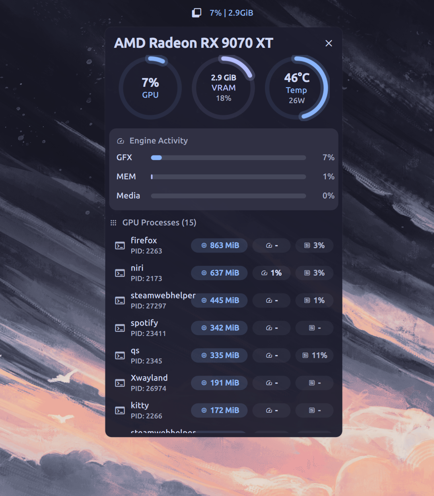
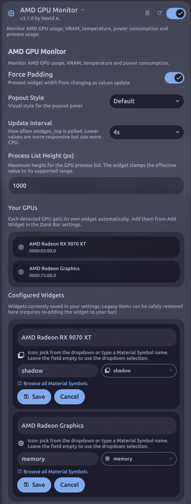

# AMD GPU Monitor

<br>
<div align="center">
  <a href="https://github.com/AvengeMedia/dms-plugin-registry/issues/490">
    
  </a>
</div>
<br>

Real-time AMD GPU monitoring plugin for DankMaterialShell. Tracks GPU usage, VRAM, temperature, power, and per-process activity for AMD GPUs, with support for multiple GPU-specific widget variants.



## Features

- GPU usage monitoring (GFX, Memory, Media Engine) — overall usage is the max of the three engines
- VRAM statistics with auto-scaling display (MiB or GiB)
- Temperature and power tracking with fallback handling for GPUs that expose sensors differently
- Per-process GPU metrics (VRAM, GFX, CPU, GTT, Compute) — filtered to active processes only
- Color-coded indicators (normal < 70% / warning 70–90% / critical > 90%)
- Smooth animations on all bars and gauges
- Three switchable popout visual styles:
  - `Default` — circular gauges
  - `Alternative` — stat cards and chips
  - `Legacy` — compact text and progress bars
- Configurable process list sorting (VRAM, GFX, CPU, Name, PID)
- Hover tooltips show the full name when a process label is truncated
- Multi-GPU widget variants — create separate widgets for GPU 0, GPU 1, and so on
- Efficient shared polling — one `amdgpu_top` call per tick for all widgets and screens
- Configurable via DankMaterialShell settings UI — no manual file editing required

## Quick Start

### Requirements

- AMD GPU
- [`amdgpu_top`](https://github.com/Umio-Yasuno/amdgpu_top)
- QuickShell
- DankMaterialShell
- Linux kernel 5.14+ (for per-process stats)

#### Install `amdgpu_top`

```bash
# From source
cargo install amdgpu_top

# Nix profile
nix profile add nixpkgs#amdgpu_top

# Arch
yay -S amdgpu_top
```

**Or** release page: <https://github.com/Umio-Yasuno/amdgpu_top/releases>

### Installation

Install the plugin via the DankMaterialShell  <a href="dms://plugin/install/amdGpuMonitor">plugin store</a>, or manually:

```bash
git clone https://github.com/navidagz/dms-amd-gpu-monitor.git ~/.config/DankMaterialShell/plugins/amdGpuMonitor
```

Then:

1. Open DMS Settings -> Plugins
2. Scan for plugins if needed
3. Enable `AMD GPU Monitor`
4. Add the widget to your bar from DMS Settings -> Bar / Widgets

## Bar Display

**Horizontal bar:** shows `GPU% | VRAM-used`, for example:

```text
45% | 6.2GiB
```

**Vertical bar:** shows the icon and GPU usage percentage only.

## Usage

**Popout Panel:** Click the widget to open detailed metrics for the selected GPU: device name, engine activity, VRAM, temperature, power, and a sortable process list.

### Popout Styles

The popout style is controlled in the plugin settings under **Popout Style**:

| Style | Description |
|---|---|
| `Default` | Circular gauges for GPU, VRAM, and temperature |
| `Alternative` | Stat-card layout with chip-style temperature and power indicators |
| `Legacy` | Classic text layout with horizontal progress bars |

You can switch styles at runtime from the DMS plugin settings UI.

### Multi-GPU Variants



GPUs are auto-detected via PCI address — no manual index entry needed. Each detected GPU gets its own widget variant automatically. All widgets share a single `amdgpu_top` poll, so adding more GPUs or screens does not multiply CPU overhead.

Use this when you want:

- one bar widget for your discrete GPU
- another bar widget for your integrated GPU
- separate widgets for each GPU in a multi-GPU system

To add a GPU widget to your bar:

1. Open DMS Settings -> Plugins -> AMD GPU Monitor
2. Scroll to **Configured Widgets** — each detected GPU already has a variant
3. Go to **Add Widget** and pick the variant you want

You can also **edit** a variant's display name and icon inline: click the edit (pencil) button, change the name and Material Symbol icon, then save. Use the reset button to restore the original detected name and icon.

Legacy variants from older plugin versions appear with a `(legacy)` tag and can be safely removed.

<br clear="right"/>

## Settings

Available in the DMS settings UI:

|| Setting | Description |
|---|---|---|
|| `Force Padding` | Keeps the horizontal bar width stable as values change. |
|| `Popout Style` | Switches between `Default`, `Alternative`, and `Legacy`. |
|| `Update Interval` | Controls how often `amdgpu_top` is polled (1s–15s). Lower values are more responsive but use more CPU. The fastest interval requested by any active widget drives the shared poll timer. |
|| `Process List Height` | Controls the maximum process list height in the popout. The widget clamps the effective value to its supported range. |
|| `Process List Sort` | Sorts the popout process list by VRAM Usage, GPU Usage (GFX), CPU Usage, Process Name, or PID. |
|| `GPU Variants` | Lists auto-detected GPUs and lets you edit widget display names and icons inline. |

## Notes

- Each variant stores its GPU by PCI address, so the correct GPU is always targeted even after hardware changes.
- Temperature data is read from `amdgpu_top` first, with fallback handling for GPUs that expose temperature via different sensor fields or sysfs.
- When a sysfs fallback is needed, the plugin resolves the GPU path from device metadata and reads the first `hwmon/*/temp1_input` entry via a direct `find` invocation without shell interpolation.

## Documentation

[Full Documentation](https://navidagz.github.io/dms-amd-gpu-monitor/docs/)

- [Installation Guide](docs/installation.md)
- [Configuration](docs/configuration.md)
- [Troubleshooting](docs/troubleshooting.md)
- [Technical Details](docs/technical-details.md)

## License

MIT License — Copyright 2026 Navid A.

## Credits

Built for [DankMaterialShell](https://github.com/DankMaterialShell) • Uses [amdgpu_top](https://github.com/Umio-Yasuno/amdgpu_top)

Special thanks to [@skrimix](https://github.com/skrimix), [@Tz-slayer](https://github.com/Tz-slayer), and [@felipeadeildo](https://github.com/felipeadeildo) for contributions and feedback.

<a href="https://github.com/navidagz/dms-amd-gpu-monitor/graphs/contributors">
  
</a>
