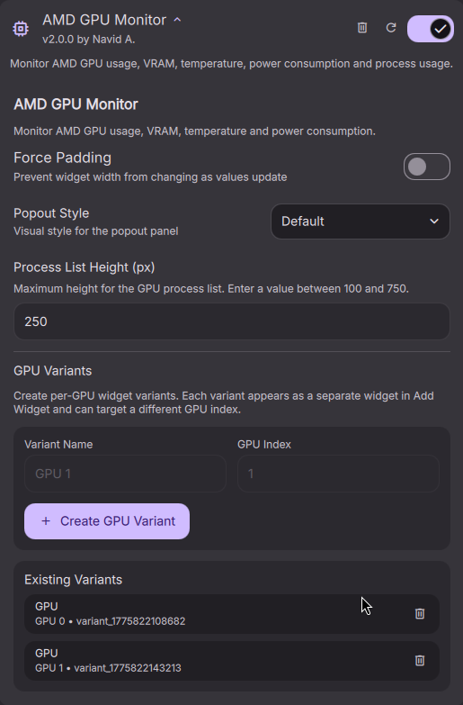

# AMD GPU Monitor

Real-time AMD GPU monitoring plugin (v2.0.0) for DankMaterialShell. Tracks GPU usage, VRAM, temperature, power, and per-process activity for AMD GPUs, with support for multiple GPU-specific widget variants.


## Features

- GPU usage monitoring (GFX, Memory, Media Engine) — overall usage is the max of the three engines
- VRAM statistics with auto-scaling display (MiB or GiB)
- Temperature and power tracking with fallback handling for GPUs that expose sensors differently
- Per-process GPU metrics (VRAM, GFX, CPU, GTT, Compute) — filtered to active processes only
- Color-coded indicators (normal < 70% / warning 70–90% / critical > 90%)
- Smooth animations on all bars and gauges
- Three switchable popout visual styles:
  - `Default` — circular gauges
  - `Alternative` — stat cards and chips
  - `Legacy` — compact text and progress bars
- Multi-GPU widget variants — create separate widgets for GPU 0, GPU 1, and so on
- Configurable via DankMaterialShell settings UI — no manual file editing required

## Quick Start

**Requirements:** AMD GPU with AMDGPU driver, `amdgpu_top`, QuickShell, DankMaterialShell, Linux kernel 5.14+ (for per-process stats)

```bash
# Install amdgpu_top (Arch)
yay -S amdgpu_top
```

Install the plugin via the DankMaterialShell plugin store, or manually:

```bash
cp -r AmdGpuMonitor ~/.config/DankMaterialShell/plugins/
```

Then:

1. Open DMS Settings -> Plugins
2. Scan for plugins if needed
3. Enable `AMD GPU Monitor`
4. Add the widget to your bar from DMS Settings -> Bar / Widgets

## Bar Display

**Horizontal bar:** shows `GPU% | VRAM-used`, for example:

```text
45% | 6.2GiB
```

**Vertical bar:** shows the icon and GPU usage percentage only.

## Usage

**Popout Panel:** Click the widget to open detailed metrics for the selected GPU: device name, engine activity, VRAM, temperature, power, and a sortable process list.

### Popout Styles

The popout style is controlled in the plugin settings under **Popout Style**:

- `Default` — circular gauges for GPU, VRAM, and temperature
- `Alternative` — stat-card layout with chip-style temperature and power indicators
- `Legacy` — classic text layout with horizontal progress bars

You can switch styles at runtime from the DMS plugin settings UI.

### Multi-GPU Variants

This plugin now supports per-GPU widget variants through the DMS variant system.

Use this when you want:

- one bar widget for your discrete GPU
- another bar widget for your integrated GPU
- separate widgets for GPU 0, GPU 1, and beyond

To create a GPU-specific widget:



1. Open DMS Settings -> Plugins -> AMD GPU Monitor
2. Scroll to **GPU Variants**
3. Enter a variant name such as `GPU 0` or `iGPU`
4. Enter the zero-based GPU index
5. Click **Create GPU Variant**
6. Go to **Add Widget** and add the newly created variant

Each created variant stores its own `gpuIndex`, so multiple AMD GPU Monitor widgets can show different GPUs at the same time.

## Settings

Available in the DMS settings UI:

- `Force Padding`
  Keeps the horizontal bar width stable as values change.
- `Popout Style`
  Switches between `Default`, `Alternative`, and `Legacy`.
- `Process List Height`
  Controls the maximum process list height in the popout. The widget clamps the effective value to its supported range.
- `GPU Variants`
  Creates and manages GPU-specific widget variants for multi-GPU systems.

## Notes

- The base plugin can still be added directly and defaults to GPU index `0`.
- For multi-GPU systems, prefer creating named variants instead of reusing the base widget.
- Temperature data is read from `amdgpu_top` first, with fallback handling for GPUs that expose temperature via different sensor fields or sysfs.
- When a sysfs fallback is needed, the plugin resolves the GPU path from device metadata and reads the first `hwmon/*/temp1_input` entry via a direct `find` invocation without shell interpolation.

## Documentation

[Full Documentation](https://navidagz.github.io/dms-amd-gpu-monitor/docs/)

- [Installation Guide](https://navidagz.github.io/dms-amd-gpu-monitor/docs/installation)
- [Configuration](https://navidagz.github.io/dms-amd-gpu-monitor/docs/configuration)
- [Troubleshooting](https://navidagz.github.io/dms-amd-gpu-monitor/docs/troubleshooting)
- [Technical Details](https://navidagz.github.io/dms-amd-gpu-monitor/docs/technical-details)

## License

MIT License — Copyright 2026 Navid A.

## Credits

Built for [DankMaterialShell](https://github.com/DankMaterialShell) • Uses [amdgpu_top](https://github.com/Umio-Yasuno/amdgpu_top)

Special thanks to [@skrimix](https://github.com/skrimix) and [@Tz-slayer](https://github.com/Tz-slayer) for contributions and feedback.
