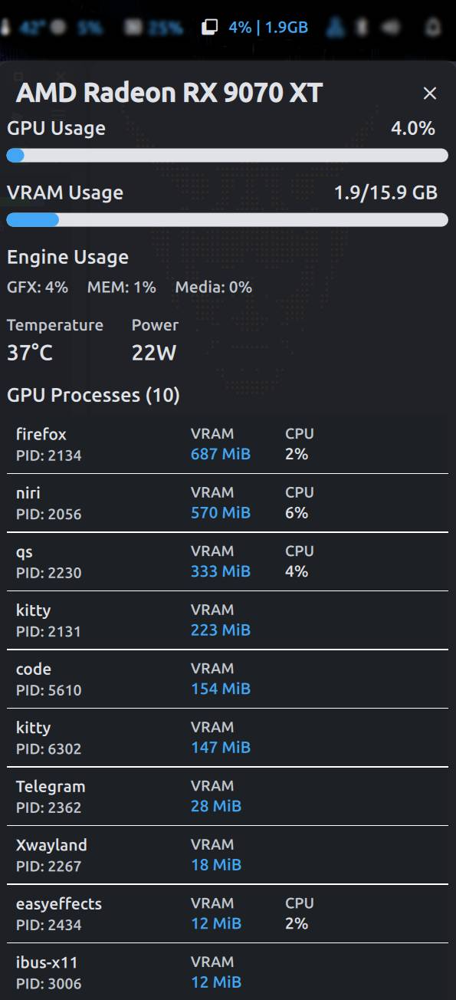

# AMD GPU Monitor Documentation

Welcome to the AMD GPU Monitor documentation. This plugin provides real-time monitoring of AMD GPU statistics for DankMaterialShell.

## Quick Navigation

### Getting Started
- [**Installation Guide**](installation) - Set up the plugin and dependencies
- [**Configuration**](configuration) - Customize behavior and appearance

### Help & Reference
- [**Troubleshooting**](troubleshooting) - Common issues and solutions
- [**Technical Details**](technical-details) - How it works and data fields

## Overview

AMD GPU Monitor tracks:
- GPU usage (GFX, Memory, Media Engine)
- VRAM statistics
- Temperature and power consumption
- Per-process GPU metrics

## Screenshots

## Quick Links

- [GitHub Repository](https://github.com/navidagz/dms-amd-gpu-monitor)
- [Report an Issue](https://github.com/navidagz/dms-amd-gpu-monitor/issues)
- [DankMaterialShell](https://github.com/DankMaterialShell)

## Features at a Glance

✓ Real-time GPU monitoring  
✓ VRAM usage tracking  
✓ Temperature and power metrics  
✓ Per-process statistics  
✓ Color-coded indicators  
✓ Smooth animations  
